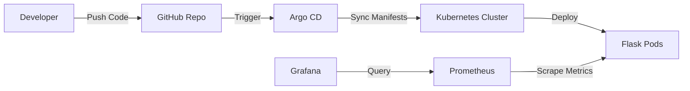

# End-to-End DevOps: Python Microservice with GitOps & Observability


## 📋 Project Overview

This project demonstrates a complete **DevOps lifecycle** for a Python Flask microservice. It showcases the implementation of **Containerization**, **Orchestration**, **GitOps**, and **Observability** best practices.

The application is containerized using Docker, deployed to a Kubernetes cluster, managed via Argo CD for continuous delivery, and monitored using a full Prometheus & Grafana stack with custom metrics.

### 🚀 Key Features & Skills Demonstrated
- **Containerization**: Optimized Dockerfile for Python Flask application.
- **Kubernetes Orchestration**: Deployment, Service (LoadBalancer), and Pod management.
- **GitOps Workflow**: Automated application synchronization using **Argo CD**.
- **Observability**: Real-time monitoring with **Prometheus** (scraping custom metrics) and **Grafana** (visualizing request rates, latency, and pod health).
- **Infrastructure as Code (IaC)**: Declarative YAML manifests for all resources.

---

## 🛠️ Tech Stack

| Category | Technology |
|----------|------------|
| **Application** | Python, Flask, Prometheus-Flask-Exporter |
| **Containerization** | Docker, Docker Hub |
| **Orchestration** | Kubernetes (K8s), Minikube/WSL |
| **CI/CD** | Argo CD (GitOps) |
| **Monitoring** | Prometheus, Grafana, Helm Charts |
| **Scripting** | Bash, PowerShell |

---

## 🏗️ Architecture



---

## 📖 Deployment Guide

### Prerequisites
- Docker installed & running
- Kubernetes Cluster (Minikube, Docker Desktop, or Cloud)
- `kubectl` and `helm` CLIs installed

### Step 1: Build & Publish Artifacts
Build the Docker image and push it to the registry.

```bash
# Build Image
docker build -t tuheen27/k8s-application:v0.1 .

# Push to Docker Hub
docker push tuheen27/k8s-application:v0.1
```

### Step 2: Infrastructure Setup (GitOps)
We use Argo CD to manage the deployment state.

1. **Install Argo CD**:
   ```bash
   kubectl create namespace argo
   kubectl apply -n argo -f https://raw.githubusercontent.com/argoproj/argo-cd/stable/manifests/install.yaml
   ```

2. **Retrieve Admin Password**:
   ```bash
   kubectl -n argo get secret argocd-initial-admin-secret -o jsonpath="{.data.password}" | base64 -d
   ```

3. **Deploy Application Manifest**:
   ```bash
   kubectl apply -f k8s/argo.yml
   ```
   *Note: Ensure ClusterRoleBinding permissions are correct if using a custom namespace.*

### Step 3: Observability Stack (Prometheus & Grafana)
Deploy the monitoring stack using Helm.

1. **Install Kube-Prometheus Stack**:
   ```bash
   helm repo add prometheus-community https://prometheus-community.github.io/helm-charts
   helm repo update
   helm install prometheus prometheus-community/kube-prometheus-stack
   ```

2. **Access Grafana Dashboard**:
   ```bash
   # Get Grafana Admin Password
   kubectl get secrets prometheus-grafana -o jsonpath='{.data.admin-password}' | base64 -d

   # Port Forward to Localhost
   kubectl port-forward svc/prometheus-grafana 3000:80
   ```
   > Access at: **http://localhost:3000** (User: `admin`)

### Step 4: Configuration & Visualization

1. **Fix Data Source Connection**:
   - In Grafana, go to **Data Sources > Prometheus**.
   - Update URL to internal K8s DNS: `http://prometheus-kube-prometheus-prometheus.default:9090`
   - Click **Save & Test**.

2. **Import Dashboard**:
   - Import Dashboard ID `11074` or use the custom JSON provided in the repo.
   - View real-time metrics for **Requests/sec**, **Latency**, and **Active Pods**.

---

## 🔧 Troubleshooting

- **Grafana Connection Refused**: Ensure you are using the internal service DNS (`prometheus-kube-prometheus-prometheus.default`) instead of `localhost` within the Grafana configuration.
- **Argo CD Sync Issues**: Verify the `targetRevision` in `argo.yml` matches your branch name (`main` or `master`).

---

*Author: Tuheen27*
